# Get Set Up

To program the Arduino, download and install the Arduino IDE. IDE stands for Integrated Development Environment. It is where code can be created, compiled, and flashed to the Arduino board. Below are instructions on how to install the Arduino IDE on Windows or Chrome Book.

# Windows

First download the Arduino IDE installer. Access the download page [here](https://support.arduino.cc/hc/en-us/articles/360019833020-Download-and-install-Arduino-IDE) and click on "Download the latest release". That will start downloading the installer, taking about a minute.

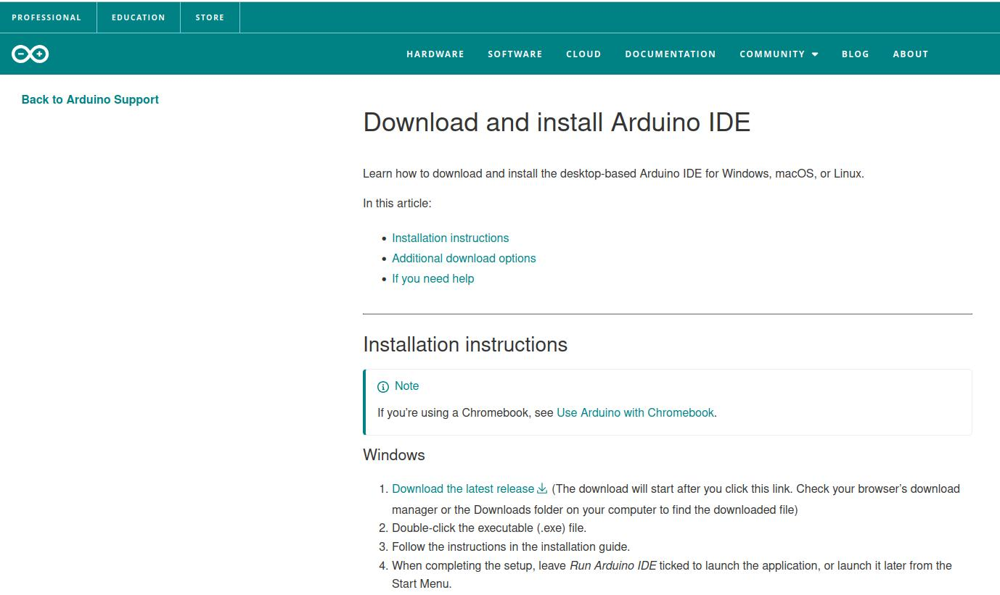

---

Once the download is complete, open file explorer. The installer will be located in Downloads.

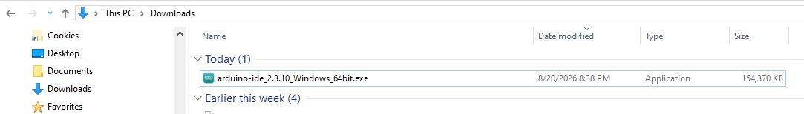

---

Double click on it. A window will pop up to accept terms of service. Click "I Agree".

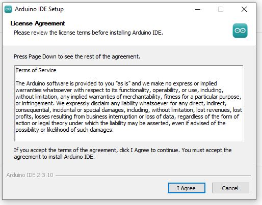

---

Select install for all users and click "Next"

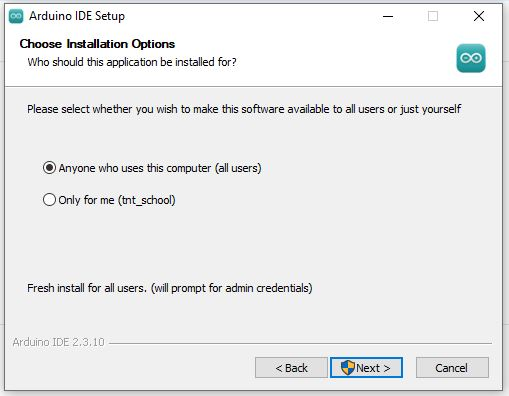

---

A propmt to accept terms of service may pop up again. If it does, click "I Agree" again.

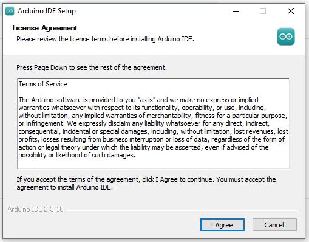

---

The destination folder should already be set to a suitable location. There should be no need to change it. Just click "Install"

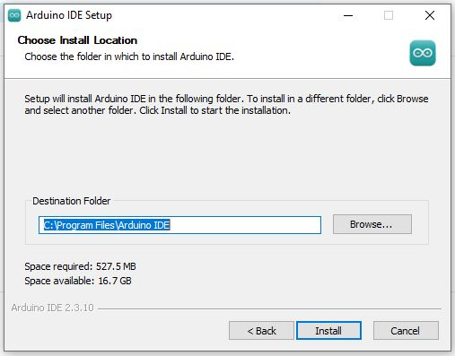

---

Next, click "Finish"

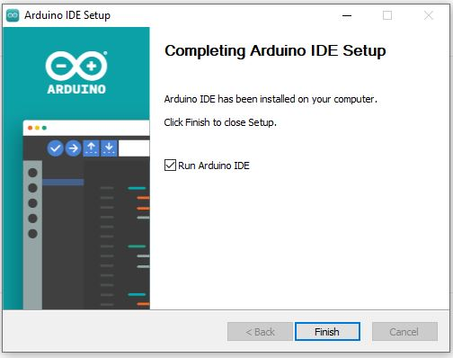

---

If a popup comes that says Windows Firewall blocked some features, click the Private Networks box and then "Allow Access".

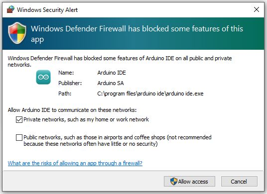

---

If popups appear to install drivers, click "Install".

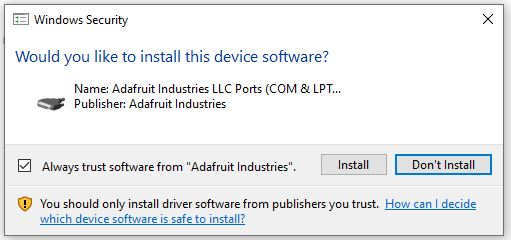

---

The IDE should have come up. If not, there should be a shortcut that can be double clicked to start it. The first thing needed is to select the board that will be programmed. For this course, select Arduino UNO.

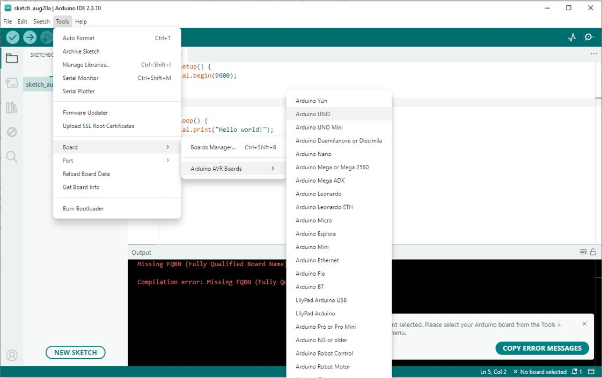

---

Place the following code in the IDE:

```
void setup() {
	Serial.begin(9600);
}

void loop() {
	delay(1000);
	Serial.println("Hello world!");
}
```

Click the checkbox at the top left. It may prompt to save the text as a file. Save it and compilation will begin and complete quickly. If all goes well, there will be white text in the terminal at the bottom of the IDE.

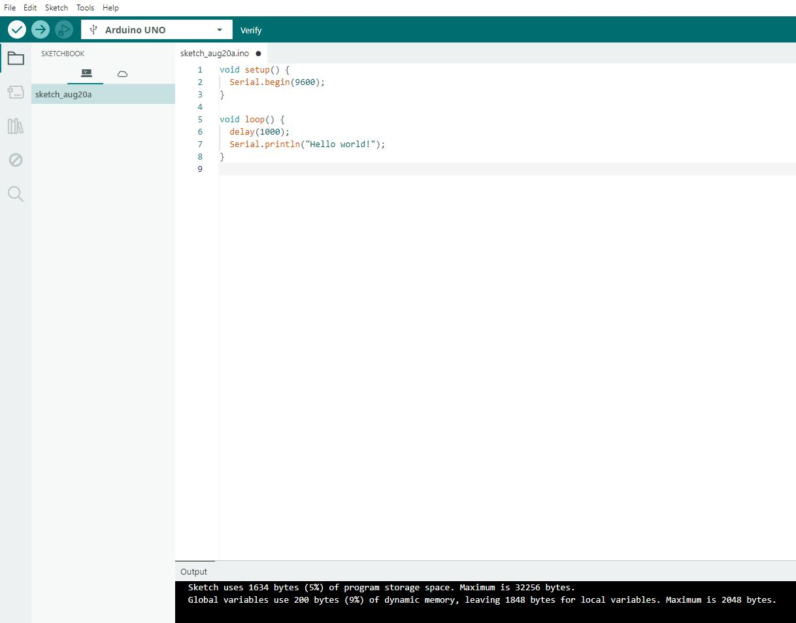

---

If the compilation fails, there will be red text in the terminal.

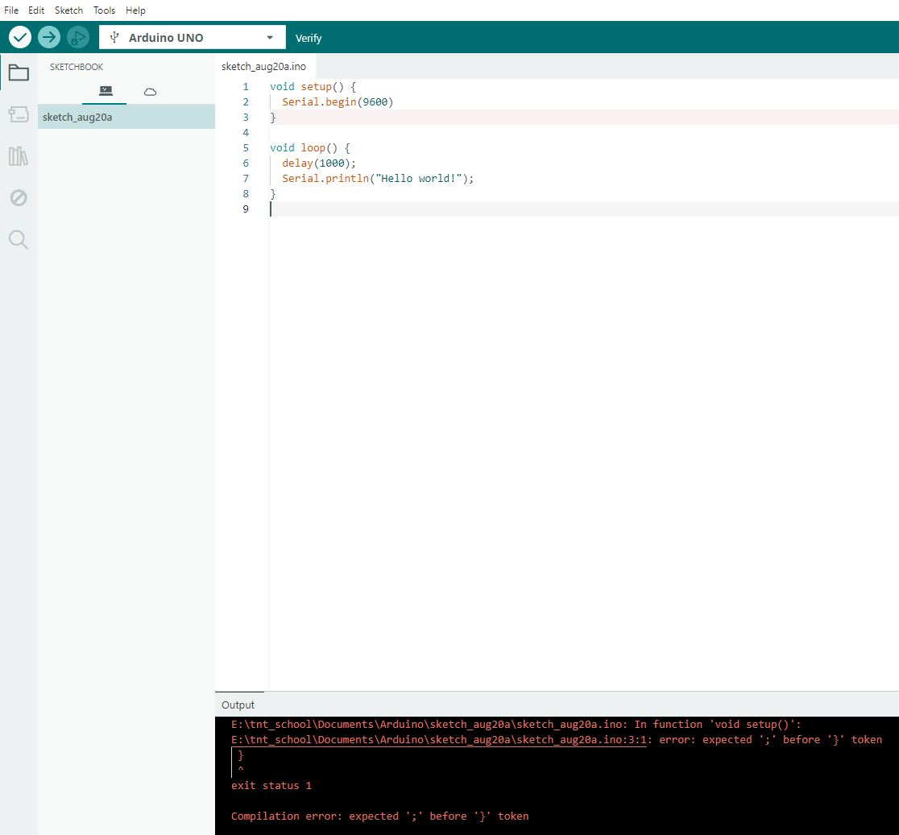

---

To upload, the compiled code to the board, plug the Arduino board into the computer via a USB port. Clicking the arrow box at the top left corner will initiate flashing the compiled software to the board. At this point, it will fail because the USB port on the computer has not been selected.

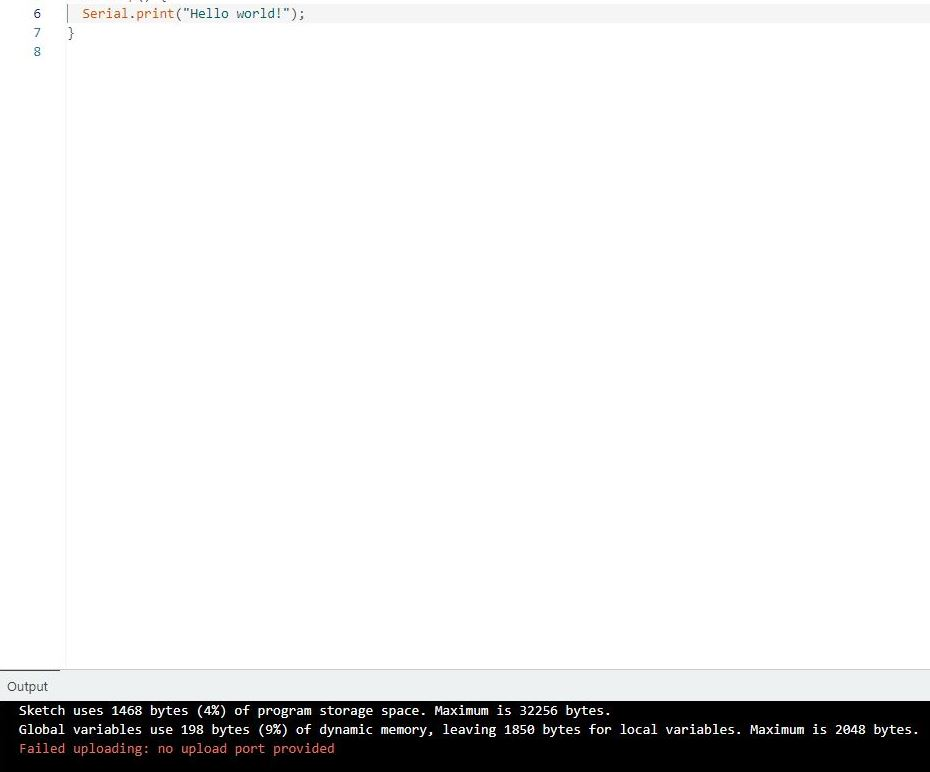

---

Select the USB port as shown below. The port will likely not be COM3 in every case.

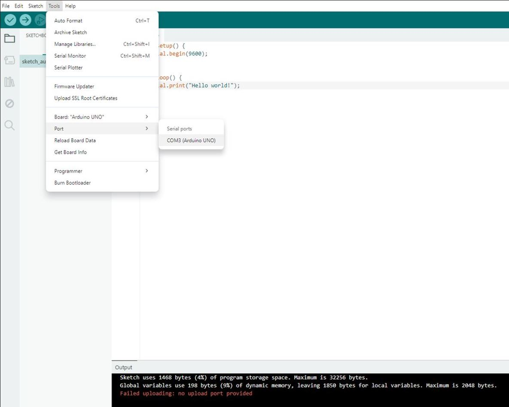

---

Now, click the arrow box at the top left corner, and the flash should be successful. White text will be in the terminal if successful just like there was when compiling earlier.


---

The software is flashed and running on the board now. It will be sending "Hello world!" to your computer, which can be viewed using Serial Monitor.


---

Make sure the baud rate at the bottom right is set to 9600. Otherwise, garbage characters may be printed. If the baud rate is 9600, "Hello world!" should be printed in the terminal every second.

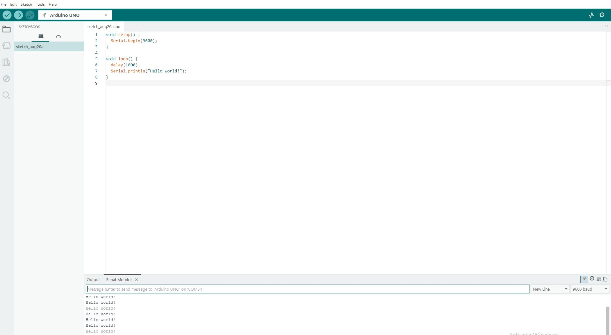

# Chrome Book

Follow instructions in [this](https://www.youtube.com/watch?v=U0qjKIS0s7g) video.

---

After completing the video and opening Arduino IDE, The first thing needed is to select the board that will be programmed. For this course, select Arduino UNO.


---

Place the following code in the IDE:

```
void setup() {
	Serial.begin(9600);
}

void loop() {
	delay(1000);
	Serial.println("Hello world!");
}
```

Click the checkbox at the top left. It may prompt to save the text as a file. Save it and compilation will begin and complete quickly. If all goes well, there will be white text in the terminal at the bottom of the IDE.


---

If the compilation fails, there will be red text in the terminal.


---

To upload, the compiled code to the board, plug the Arduino board into the computer via a USB port. Clicking the arrow box at the top left corner will initiate flashing the compiled software to the board. At this point, it will fail because the USB port on the computer has not been selected.


---

Make sure to follow directions at the end of the video so that the USB port shows up in the IDE. Select the USB port as shown below. The port will likely not be the same COM3.


---

Now, click the arrow box at the top left corner, and the flash should be successful. White text will be in the terminal if successful just like there was when compiling earlier.


---

The software is flashed and running on the board now. It will be sending "Hello world!" to your computer, which can be viewed using Serial Monitor.


---

Make sure the baud rate at the bottom right is set to 9600. Otherwise, garbage characters may be printed. If the baud rate is 9600, "Hello world!" should be printed in the terminal every second.


