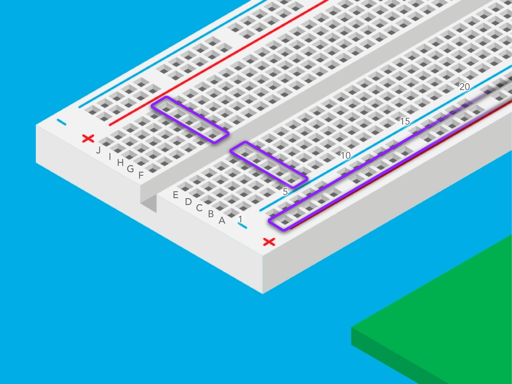
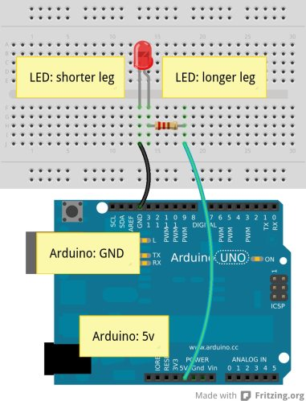
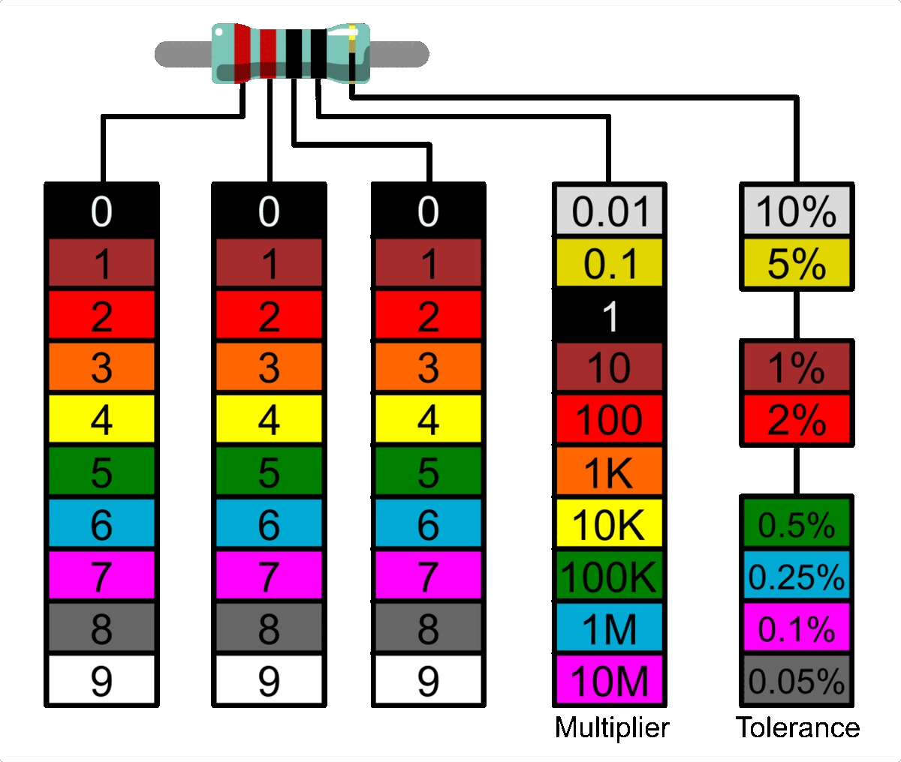
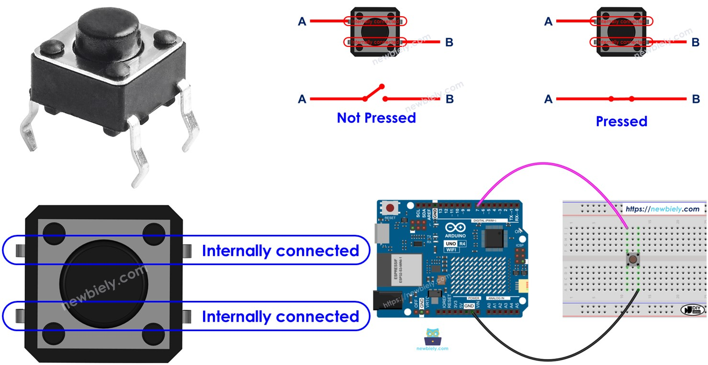
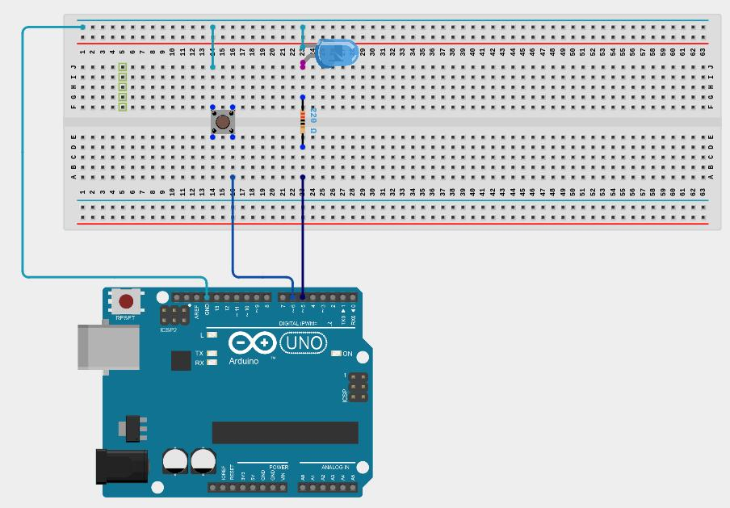

# Lesson 1: LED and Button

# Coding Tools

There are three functions to know about for this lesson (you will learn more about what functions are in a later lesson). They are used to configure pins on the Arduino board. Pins are what allow the board to interract with and control other electrical components. Pins can be configured to do different kind of things, but for now, think of them as being able to either output a binary signal or read a binary signal. A binary signal is a signal that can only be in two states. Either the signal is high or low. High means voltage is present and electrical current is flowing to or from the pin. Low means there is no voltage and no electrical current flowing to or from the pin.

The three functions used to configure pins are listed below:

## pinMode

**pinMode(pin, configuration);**

**parameters:**
1. **pin** - the number identifying the pin that you want to configure
2. **configuration** - specifies if you want the pin to be input or output (literally set it as INPUT or OUTPUT)

**examples:**
```
configure pin 5 as output:

pinMode(5, OUTPUT);
```

```
configure pin 6 as input:

pinMode(6, INPUT);
```

## digitalWrite

**digitalWrite(pin, state);**

**parameters:**
1. **pin** - the number of pin identifying the pin that you want to configure
2. **state** - specifies if you want the pin to be high or low (literally set it as HIGH or LOW)

NOTE: digitalWrite should only be used on pins that have been configured as output using pinMode

**examples:**
```
set pin 5 as high:

digitalWrite(5, HIGH);
```

```
set pin 5 as low:

digitalWrite(5, LOW);
```

## digitalRead

**int state = digitalRead(pin);**

**parameters:**
1. **state** - the value returned that informs you if the pin is high or low (it will be equal to either HIGH or LOW)
2. **pin** - the number of pin identifying the pin that you want to configure

**Return value:**

**state** - state of the pin (either HIGH or LOW)

NOTE: digitalRead should only be used on pins that have been configured as input using pinMode

**example:**
```
read pin 6:

int state = digitalRead(6);
```

# Electrical Components
The electrical components needed are a breadboard, an LED, a resistor, a button, and some wires.

## Breadboard

The bread board is used to mount electrical components to and connect circuits together. The holes are connected together as shown in the below image.



The rails on the outsides are connected for the full length of the board. The holes in the middle are connected together in the shorter direction, and they are separated by the divider in the middle of the board that runs down its length.

## LED

The LED is polarized, meaning it matters what direction electricity flows through it. If electricity flows the wrong way, the LED will be damaged. The wire coming from the LED that is longer should be connected to the positve side while the shorter wire should be connected to ground. Below is a picture demonstrating this.



## Resistor (220 ohms)

In this lesson, the resistor is used to limit the amount of current flowing through the LED. Without it, the LED would burn up. Select a 220 ohm resistor. The resistance of the resistor is indicated by the colored bands on it. The first three bands are red red black for a 220 ohm resistor.



## Button

The button works as a switch that allows no current to flow through it when not pressed, but allows current to flow through it when pressed because the circuit is completed. Note that each side of the button is always connected, but the two sides are only connected when the button is pressed. Look at the image below for clarification.



## Schematic

The wiring for this lesson should be the same as shown in the below schematic. Make sure that the longer side of the LED is facing the positive side (pin 5), and the shorter side is facing ground (GND).




# Requirements

Whenever the button is held down, the LED should turn on. Whenever the button is not being held down, the LED should be off.

Below is a template to help you get started.

```
void setup() {
  // Configure pins 5 and 6 with the pinMode function

}

void loop() {
  // Use digitalRead to read the button's state on pin 6
  // Use the returned value from digitalRead to set the state of the LED using digitalWrite

  delay(100);

}
```

## Tips
- Code inside the setup curley braces is ran only once when the Aruino board first starts.
- Code inside the loop curley braces is continuously run the entire time the Arduino board is on (when the bottom of the loop block is reached, it goes back to the top of the block and repeats over and over).
- The delay function is used to have the arduino sleep so that it does not use the CPU at 100% (in this case, it sleeps for 100 milliseconds which is 1/10 of a second).
- Lines starting with // are comments and are ignored when compiled. You may remove them if desired.
- All lines of code that you add must end with a semicolon -> ;
