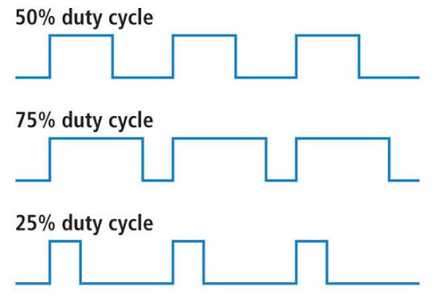

# Lesson 3: Arithmetic Operators and For Loops

# Coding Tools

## Arithmetic Operators

Arithmetic operators are used to do mathematical operations on numbers. They include the following:

- \+ (addition)
- \- (subtraction)
- \* (multiplication)
- / (division)
- % (modulus)
- ++ (increment)
- \-- (decrement)

## + (addition)

The + operator is used to add two numbers together.

**example**
```
int my_number = 4 + 2; // my_number equals 6

my_number = my_number + 10; // my_number equals 16
```

## - (subtraction)

The - operator is used to subtract one number from another.

**example**
```
int my_number = 4 - 2; // my_number equals 2

my_number = my_number - 1; // my_number equals 1
```

## * (multiplication)

The * operator multiplies two numbers together.

**example**
```
int my_number = 4 * 2; // my_number equals 8

my_number = my_number * 10; // my_number equals 80
```

## / (division)

The / operator divides one number by another

**example**
```
int my_number = 4 / 2; // my_number equals 2

my_number = my_number / 2; // my_number equals 1
```

## % (modulus)

The % operator divides one number by another and returns the remainder.

**example**
```
int my_number = 8 % 3; // my_number equals 2 (8 can be divided by 3 twice with 2 as the remainder)

my_number = 8 % 4; // my_number equals 0
```

## ++ (increment)

The ++ operator increases a number by 1. It is exactly the same as my_number = my_number + 1.

**example**
```
int my_number = 0;

my_number++; // my_number equals 1
```

## -- (decrement)

The -- operator decreases a number by 1. It is exactly the same as my_number = my_number - 1.

**example**
```
int my_number = 0;

my_number--; // my_number equals -1
```

## For Loops

For loops are used to loop over a block of code until a certain condition is met. There are three parts of a for loop that should be configured. The syntax of a for loop is shown below:

```
for (part 1; part 2; part 3)
{
	// code block to be executed
}
```

- Part 1 is executed one time before the execution of the code block. It is often used to initialize the variable used to track how many times the for loop should run.

- Part 2 defines the condition for executing the code block. It is a boolean expression evaluated everytime the for loop is about to start. If it evaluates to true, the for loop runs another iteration. If it evaluates to false, the for loop does not run any more.

- Expression 3 is executed every time after the code block has been executed. It is often used to increment the variable used to track how many times the for loop should run.

**examples**
```
int my_number = 0;

for (int i = 0; i < 10; i++)
{
	my_number = my_number + 2;

	// i increases by one at the end of the for loop every time it repeats.
}

// This for loop will run 10 times
// my_number will equal 20 once it completes
```

```
int my_number = 10;

for (int i = 10; i > 0; i--)
{
	my_number = my_number - 2;

	// i decreases by one at the end of the for loop every time it repeats.
}

// This for loop will run 10 times
// my_number will equal -10 once it completes
```

```
int my_number = 0;

for (int i = 0; i < 10; i = i + 2)
{
	my_number = my_number + 2;

	// i increases by two at the end of the for loop every time it repeats.
}

// This for loop will run 5 times
// my_number will equal 10 once it completes
```

```
int my_number = 10;

for (int i = 10; i > 0; i = i - 2)
{
	my_number = my_number - 2;

	// i decreases by two at the end of the for loop every time it repeats.
}

// This for loop will run 5 times
// my_number will equal 0 once it completes
```

## analogWrite

analogWrite is a function provided by the Arduino IDE. You will be learning about functions soon in an upcoming lesson. analogWrite is similar to digitalWrite that you have used earlier. However, instead of only setting the pin high or low, analogWrite creates an analog signal. Analog means that the voltage can be "any" value between 0 and 5 volts (5 volts because that is the maximum voltage the pin can do). How can this be? Computers are digital, not analog. Pins on the Arduino are only capable of being on or off. This "analog" signal, it turns out, is an illusion. Here is how it works:

analogWrite uses PWM (Pulse Width Modulation). PWM involves a steady pulse that will be high for a certain percentage of the pulse, and it will be low for the remaining percentage. The percentage that the pulse is high is referred to as the "Duty Cycle". Below is a visual example.



**analogWrite(pin, pwm_level);**

analogWrite is used to send an "analog" signal out of the microcontroller.

**parameters:**
1. **pin** - the number of pin identifying the pin that you want to configure
2. **pwm_level** - specifies the duty cycle as a level 0 to 255 (so duty cycle would be (pwm_level / 255) * 100)

**examples:**
```
// set duty cycle on pin 5 at 50%:

analogWrite(5, 128);
```

```
// set duty cycle on pin 5 at 100%

analogWrite(5, 255);
```

```
// set duty cycle on pin 5 at 0%

analogWrite(5, 0);
```

One cool use for this is changing the brightness of an LED. The higher the duty cycle, the brighter the LED will be. The lower the duty cycle, the dimmer the LED will be.

# Requirements

For this lesson, use the same electrical components as in lesson 1 with the same wiring minus the button (you can leave the button there if you want, but we will not be using it)

Create two for loops. One increments from 0 to 255, increasing the duty cycle so that the LED keeps getting brighter. Place a 10 millisecond delay in the for loop. The second decrements from 255 to 0, decreasing the duty cycle so that the LED keeps getting dimmer. Place a 10 millisecond delay in the for loop. The end result should be that the LED keeps getting brighter and dimmer over and over again. A template to help you get started is below.

```
void setup()
{
  // configure pin 5

}

void loop()
{
  // Create a for loop that goes from 0 to 255. It should make the LED get gradually brighter

  // Create another for loop that goes from 255 to 0. It should make the LED get gradually dimmer.
}
```
