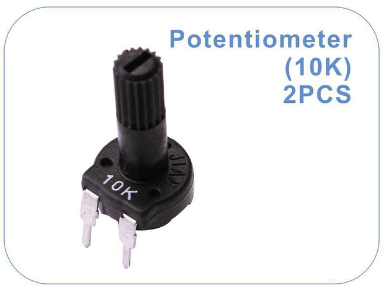
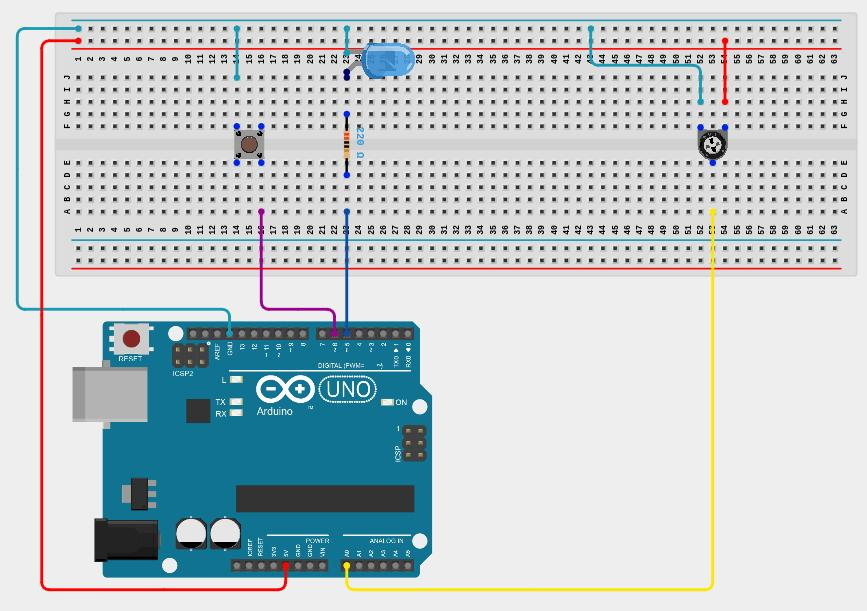

# Lesson 4: Wile Loops

# Coding Tools

## While Loops

Similar to for loops, while loops iterate over a block of code until a condition is met. Unlike for loops, there is only one part (condition) instead of three. The syntax for a while loop is shown below:

```
while (condition)
{
	// code block to be executed
}
```

The condition in the while loop is a boolean condition just like the second part of a for loop. If the condition evaluates to true, the while loop runs another iteration. If the condition evaluates to false, the while loop stops running.

**examples**

```
while (true)
{
	// code block to be executed
}

// This while loop will run forever
```

```
while (false)
{
	// code block to be executed
}

// This while loop will never run
```

```
int my_number = 0;
int i = 0;

while (i < 10)
{
	my_number++;
}

// This while loop will run forever
```

```
int my_number = 0;
int i = 0;

while (i < 10)
{
	my_number++;
	i++;
}

// This while loop will run 10 times.
// my_number will be 10 once it is complete
```

```
int state = 1;

while (state == 1)
{
	state = digitalRead(6);
	delay(10);
}

// This while loop will run until the button connected to pin 6 is pressed
```

## analogRead

analogRead is used to get the analog value of a pin. Like with analogWrite, "analog" is an illusion. Instead of being able to measure any value between 0 and 5 volts, the range is divided into 1024 levels. So the resolution is 5/1024 = 0.00488 volts, which means it is not possible to detect a change in voltage less than 0.00488 volts. Note analogRead only works on the following pins: A0, A1, A2, A3, A4, A5

**int analogRead(pin)**

**parameters**
1. pin - the number of pin identifying the pin that you want to read an analog signal from

**Return value**

int - a value 0 to 1023 that represents the amount of voltage being measured

**example**
```
// Read the voltage measured on A0

int voltage_level = analogRead(A0);
```
# Electrical Components

## Potentiometer

A potentiometer acts as a variable resistor. This means that its resistance can be changed, which will change the voltage that comes out of it. For example, if 5V goes into the potentiometer and the knob is turned half way, 2.5 volts would come out, assuming the potentiometer is linear. A picture of a potentiometer is shown below:



# Requirements

This lesson will require the use of a potentiometer in addition to the button and LED used in previous lessons. The schematic for this lesson is shown below:



This lesson will involve something similar to the previous lesson involving analogWrite to change the brightness of the LED. However, this time, while loops will be used instead of for loops, and analogRead will also be used.

There will be two while loops. The first will make the LED gradually become brighter while the second will make the LED gradually become dimmer. However, the while loop that is running should not exit until the button has changed states from not being pressed to being pressed. In the while loop that is increasing the duty cycle of the PWM, the maximum pwm level will be determined by the level of the analog signal from the potentiometer.

To use the number coming from analogRead, it must first be converted to a voltage. Then, the voltage must be converted to a value between 0 and 256. The formula to convert the analog signal to a value between 0 and 256 is:

```
analog_signal X (5 volts / 1023) X (255 / 5 Voltgs)

or

analog_signal X (255 / 1023)
```

In code, this would be:

```
int analog_signal = analogRead(A0);
int duty_cycle = (int)((float)analog_signal * (255.0 / 1023.0));
```

NOTE: The use of (int) and (float) is used to cast the numbers as different types. analog_signal was an integer, but (float)analog_signal means that it is interpreted as a float. 255 instead of 255.0 and 1023.0 instead of 1023 means that they are treated as floats instead of integers. If they were integers, 255 / 1023 would equal 0 instead of 0.249 (If the result of 255 / 1023 is an integer, it is rounded down to the nearest whole number, which is 0). After everything is evaluated, it is cast as an integer since analogWrite takes an integer, not a float.

Once the pwm level increasing in the first while loop equals the pwm level measured by the potentiometer, the pwm level will be set back down to 0.

In the second while loop, the pwm level measured by the potentiometer will define the minimum value the pwm level can be since the pwm level is decreasing in that loop. Upon reaching this level, the pwm level will be set back up to 255.

Below is a template to help you get started:

```
int state = 1;
int previous_state = 1; // use state and previous state to detect when the button is pressed
int pwm_level = 0; // use pwm_level to set the brightness of the LED
int pwm_level_setpoint = 255; // use pwm_level_setpoint to define the maximum pwm level in the first while loop and 
                              // the minimum pwm level in the second while loop

void setup()
{
  // initialize the pins for button and LED
  // no initialization is needed for the analog pin
}

void loop()
{
  previous_state = 0;
  state = 0;

  // place the first while loop here
  // it will gradually increase the pwm level until it equals pwm_level_setpoint, which will result in pwm_level being set to 0
  // this while loop should read the button state and also the potentiometer on every iteration
  // have the while loop sleep for 10 milliseconds at the end of each iteration

  previous_state = 0;
  state = 0;

  // place the second while loop here
  // it will gradually decrease the pwm level until it equals pwm_level_setpoint, which will result in pwm_level being set to 255
  // this while loop should read the button state and also the potentiometer on every iteration
  // have the while loop sleep for 10 milliseconds at the end of each iteration
}
```
