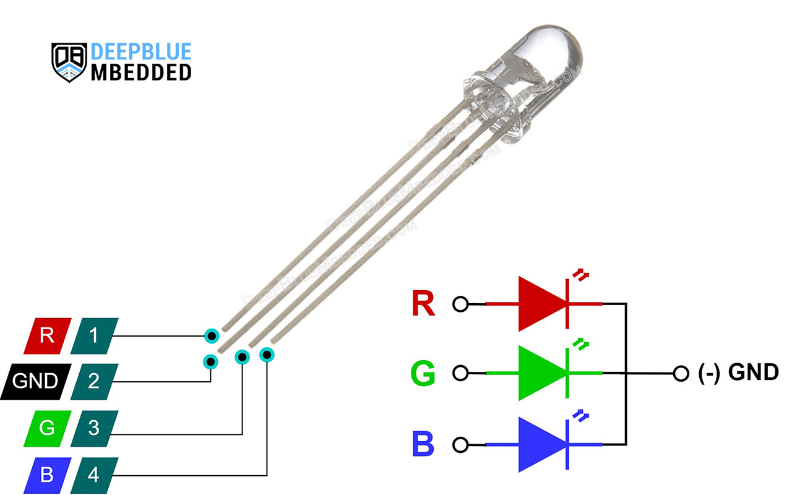
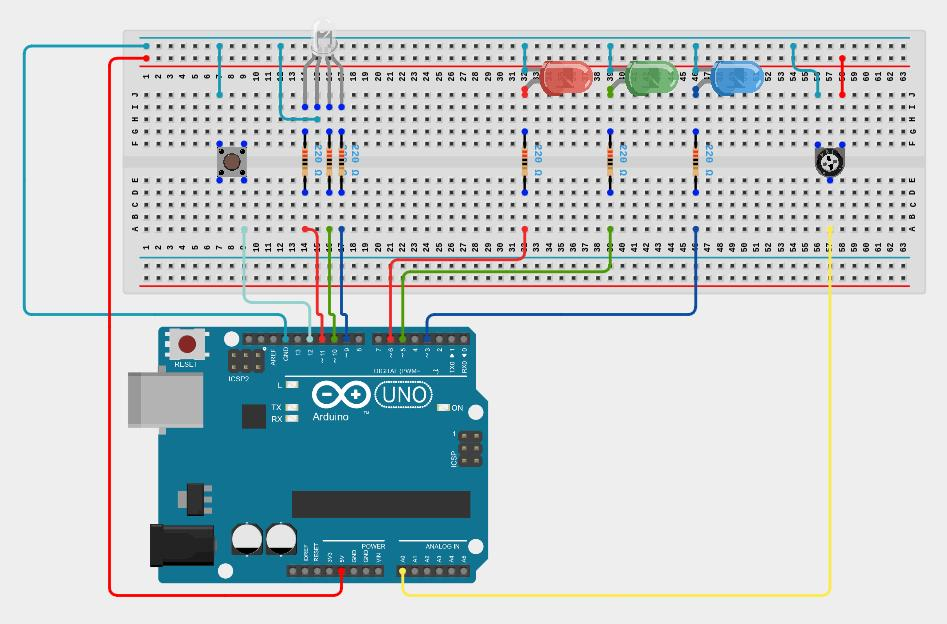

# Lesson 5: Functions

# Coding Tools

## Functions

A function is a block of reusable code. This means that it saves you from rewriting the same code every time it is needed. It also is a vital tool for organizing code and making it more understandable. pinMode, digitalWrite, digitalRead, analogWrite, and analogRead are all functions you have already been using. Now, you will learn how to make your own function. The syntax for a function is shown below:

```
type my_function(type argument_1, type argument_2)
{
	// code to run and do things with the arguments

	return variable_to_return;
}
```

You can define your function to take any number of arguments (It does not have to be two arguments It could be 0 or as many as you need). A function does not need to return anything, but if it does, it can not return any more than one value.

**examples**
```
// create a function that calculates the square of a number
int square(int x)
{
    return x * x;
}

int my_number = square(2);

// my_number equals 4

my_number = square(my_number);
// my_number equals 16
```

A function can return nothing. In that case, put void as the return value:
```
void turn_pin_off(int pin)
{
	digitalWrite(pin, LOW);
}

// turn pin 5 off
turn_pin_off(5);
```

A function can have no arguments. In that case, put nothing between the paranthesis.
```
void turn_pin_5_off()
{
	digitalWrite(5, LOW);
}

// Now run the function to actually turn pin 5 off

turn_pin_5_off();
```

# Electrical Components

RGB LED

The RGB LED can change its color to be a wide range of colors because it has three LEDs inside it (Red, Green, and Blue). By changing the duty cycle of pwm going to each color of LED, it is possible to make different colors. The RGB LED that comes with the Arduino kit is shown below:



# Requirements

The requirements for this lesson is to design an adjustable RGB LED. The user will be able to configure it to be different colors by changing the brightness of the red, green, and blue lights in the RGB LED. A schematic is shown below:



The potentiometer should be used to change the brightness of one of the colors of the RGB LED. When the button is released after being pressed down, the color that is being adjusted should increment to the next color.

You are required to create two functions to help accomplish this. 

One function should be called apply_rgb and be used to set the brightness of one of the colors in the RGB LED. It should not return anything, and it should have two arguments. One argument should be int type and the other char type. The int type should be the value provided from the analogRead function on pin A0 from the potentiometer. The char type argument should be a variable that is either 'r', 'g', or 'b'. If the char argument is 'r', the int argument from the potentiometer should be converted to a valid pwm number (0 to 255) and applied to the red pin of the RGB LED. The same process applies when the char argument is 'g' or 'b', except the green or blue LED's brightness is changed with pwm using analogWrite.

The second function should be called increment_rgb and be used to change which color that is being adjusted of the RGB LED. It should return a char, and it should have one argument that is a char. This char argument should be 'r', 'g', or 'b'. If the argument is 'r', then the function should return 'g'. If the argument is g, the function should return 'b'. If the argument is 'b' or any other value, it should return 'r'. Notice that there are three LEDs shown in the above schematic other than the RGB LED. These three LEDs are colored red, green, and blue. These are used to indicate which color of the RGB LED is being adjusted. So, the increment_rgb function will perform a second task because it needs to turn on one of those three LEDs depending on what color it incremented to.

Below is a template to help you get started. Notice that most of the loop function is already complete. You just need to add the condition in the if statement. Your main assignment is creating the apply_rgb and increment_rgb functions. You also need to configure pins in setup.

```
int button_state = 1;
int previous_button_state = 1;
char rgb = 'r';

// create function called apply_rgb here

// create function called increment_rgb here

void setup()
{
  // configure pins 3, 4, 5, 6, 9, 10, and 11
}

void loop()
{
  previous_button_state = button_state;
  button_state = digitalRead(4);
  if (// add condition for when the button is released )
  {
    rgb = increment_rgb(rgb);
  }

  int rgb_strength = analogRead(A0);
  apply_rgb(rgb_strength, rgb);
  delay(10);
}
```
