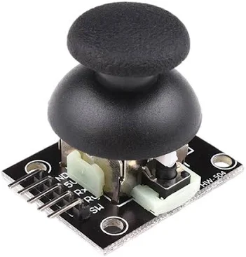
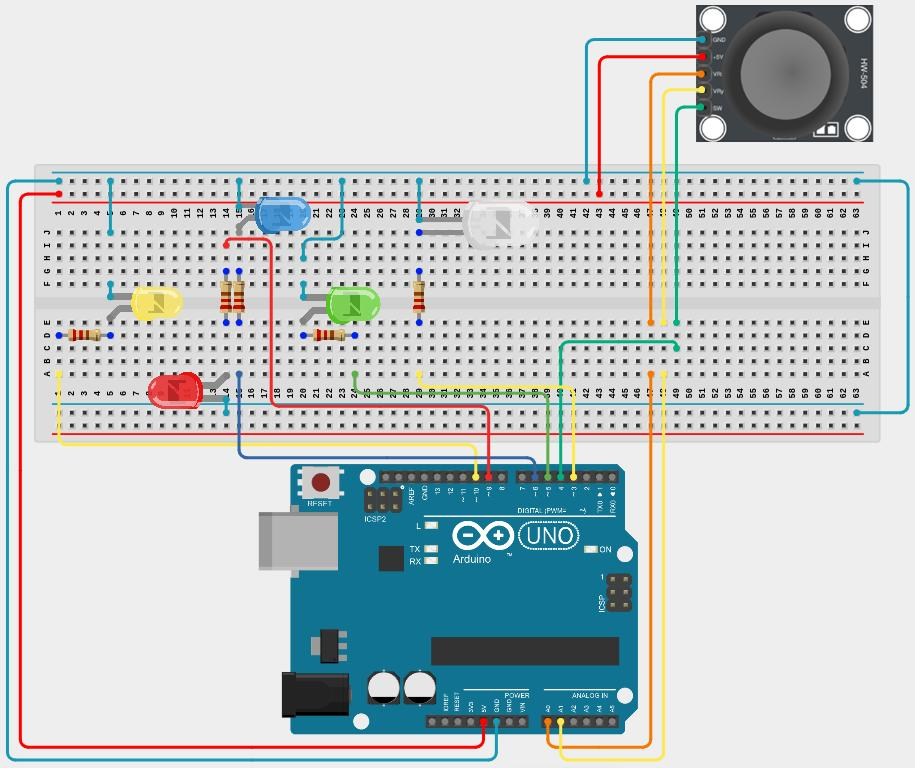
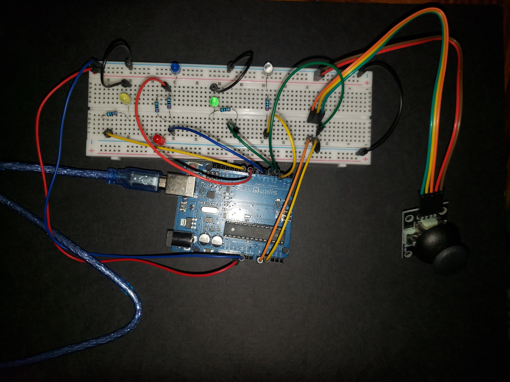

# Lesson 6: Structures

## Coding Tools

## Structures

Structures are used to group data together. A structure is essentially a custom variable type that can contain variables inside it. For example, say you create a structure called "cool_stuff" that contains a number called "my_cool_number" and a character called "my_cool_character". The way to do this is shown below.

```
struct cool_stuff
{
	int my_cool_number;
	char my_cool_character;
};
```

To then use the structure, you would have to create a new variable of that structure type. Below, a variable that is of the cool_stuff type is declared. The variable is called my_structure. The variables in the structure are accessed using a period. In the below example, my_cool_number inside the structure is assigned the value 1, and my_cool_character is assigned the letter t.

```
struct cool_stuff my_structure;

my_structure.my_cool_number = 1;
my_structure.my_cool_character = 't';
```

It is also possible to evaluate values inside the structure.

```
struct cool_stuff my_structure;

my_structure.my_cool_number = 1;
my_structure.my_cool_character = 't';

if (my_structure.my_cool_number == 1)
{
	my_structure.my_cool_character = 'u';
}

// my_cool_character inside my_structure equals 'u' once this code runs
```

Note that structures can contain any number of variables of any type inside them, not just int or char variables.

# Electrical Components

## Joystick

The joystick provided in the kit has five pins, which are labeled GND, +5V, VRx, VRy, and SW.

- GND: Attach to ground
- +5V: Attach to 5 volts
- VRx: Analog signal coming out of the joystick indicating the orientation of the joystick in the x axis. It is 2.5 volts at rest, 0 volts when pushed all the way in one direction, and 5 volts when pushed all the way in the opposite direction.
- VRy: Analog signal coming out of the joystick indicating the orientation of the joystick in the y axis. It is 2.5 volts at rest, 0 volts when pushed all the way in one direction, and 5 volts when pushed all the way in the opposite direction.
- SW: On or off signal coming out of the joystick indicating if the button on the side is being pressed

Note that 0 volts corresponds to 0 returned from analogRead, 2.5 volts corresponds to 511 returned from analogRead, and 5 volts corresponds to 1023 returned from analogRead (analogRead was introduced in lesson 5).



# Requirements

This lesson includes a joystick and LEDs. Four LEDs are used to indicate which direction the joystick is moved. The joystick has two axes and each axis has two directions (up or down in the y axis and right or left in the x axis). So, one LED is for the up direction, one is for the down direction, one is for the right direction, and one is for the left direction. There also will be a fifth LED to indicate when the joystick is being pressed.

The LED brightness should be adjusted using PWM (introduced in lesson 3). When the joystick is moved in a direction, the corresponding LED should become brighter. Since there are two axes of motion, and the joystick can be moved in both at once, it is possible for up to two directional LEDs to be lit at the same time.

For example, if you were to move the joystick upwards and to the left, the up (blue) LED and the left (yellow) LED should both become brighter.

If the joystick is pressed like a button, the fifth LED should turn on. If the joystick is not being pressed, the fifth LED should remain off.

A schematic and picture of the wiring for the lesson are below:





Below is the template for this lesson. Much of it is complete. You must go through and add code where there are comments. Take note of the two structures defined at the top that are used throughout the code.

```
struct joystick_data
{
  int x;
  int y;
  bool button_pressed;
};

struct led_data
{
  int up;
  int down;
  int left;
  int right;
  bool button_led_on;
};

const int middle_joystick_value = 511;
const int deadzone = 30;

int joystick_analog_to_pwm_level(int analog_level)
{
  return (int)((float)analog_level * (255.0 / 511.0));
}

bool joystick_axis_in_deadzone(int analog_level)
{
  return (analog_level > (middle_joystick_value - deadzone)) && (analog_level < (middle_joystick_value + deadzone));
}

struct joystick_data get_joystick_data()
{
  struct joystick_data joystick;
  // read pin 4 and assign its value to button_pressed (should you invert value returned from digitalRead with the ! operator?)
  // read analog level using analogRead on pin A0 and assign it for x axis
  // read analog level using analogRead on pin A1 and assign it for y axis

  return joystick;
}

struct led_data convert_joystick_data_to_led_data(joystick_data joystick)
{
  struct led_data leds;

  if (joystick_axis_in_deadzone(joystick.x))
  {
    // set right led in leds structure to 0
    // set left led in leds structure to 0
  }
  else if (joystick.x < middle_joystick_value)
  {
    // use joystick_analog_to_pwm_level function to set left led value in leds structure
    // (value given to joystick_analog_to_pwm_level should be middle_joystick_value minus joystick.x)

    // set right led in leds structure to 0
  }
  else
  {
    // set left led in leds structure to 0

    // use joystick_analog_to_pwm_level function to set right led value in leds structure
    // (value given to joystick_analog_to_pwm_level should be joystick.x minux middle_joystick_value)
  }


  if (joystick_axis_in_deadzone(joystick.y))
  {
    // set up led in leds structure to 0
    // set down led in leds structure to 0
  }
  else if (joystick.y < middle_joystick_value)
  {
    // use joystick_analog_to_pwm_level function to set up led value in leds structure
    // (value given to joystick_analog_to_pwm_level should be middle_joystick_value minus joystick.y)

    // set down led in leds structure to 0
  }
  else
  {
    // set up led in leds structure to 0

    // use joystick_analog_to_pwm_level function to set down led value in leds structure
    // (value given to joystick_analog_to_pwm_level should be joystick.y minus middle_joystick_value)
  }

  leds.button_led_on = joystick.button_pressed;

  return leds;
}

void light_leds(led_data leds)
{
  analogWrite(5, // right led value from leds);
  analogWrite(6, // up led value from leds);
  analogWrite(9, // down led value from leds);
  analogWrite(10, // left led value from leds);
  digitalWrite(3, // button_led_on from leds);
}

void setup()
{
  pinMode(3, OUTPUT);
  pinMode(4, INPUT_PULLUP);
  pinMode(5, OUTPUT);
  pinMode(6, OUTPUT);
  pinMode(9, OUTPUT);
  pinMode(10, OUTPUT);
}

void loop()
{
  struct joystick_data joystick = get_joystick_data();
  struct led_data leds = convert_joystick_data_to_led_data(joystick);
  light_leds(leds);
  delay(1);
}
```
