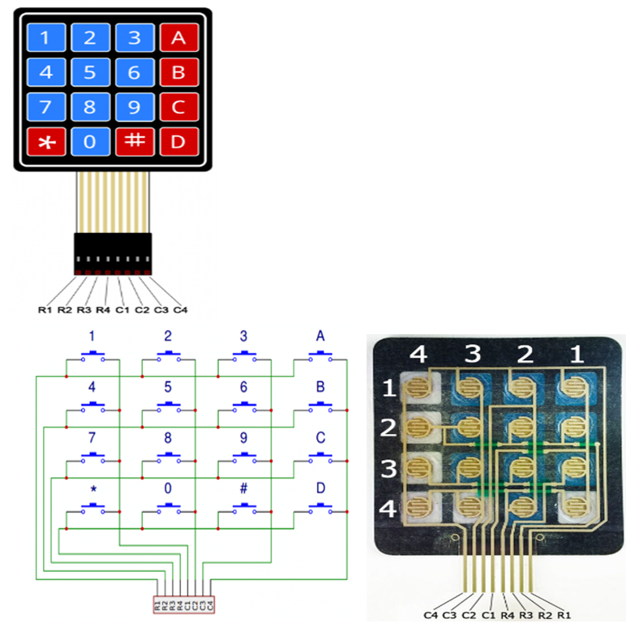
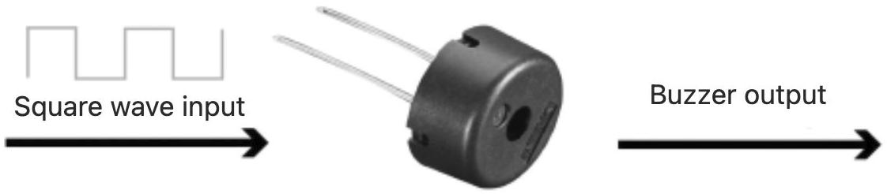
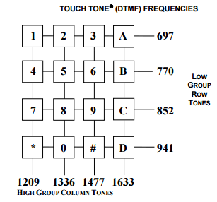
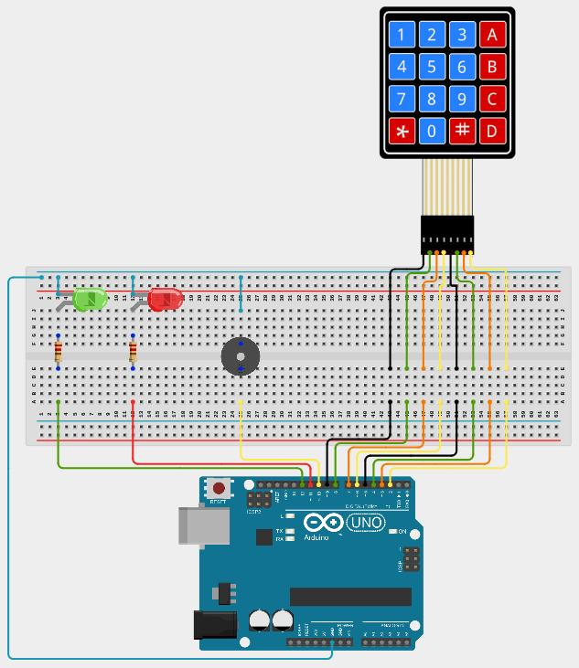
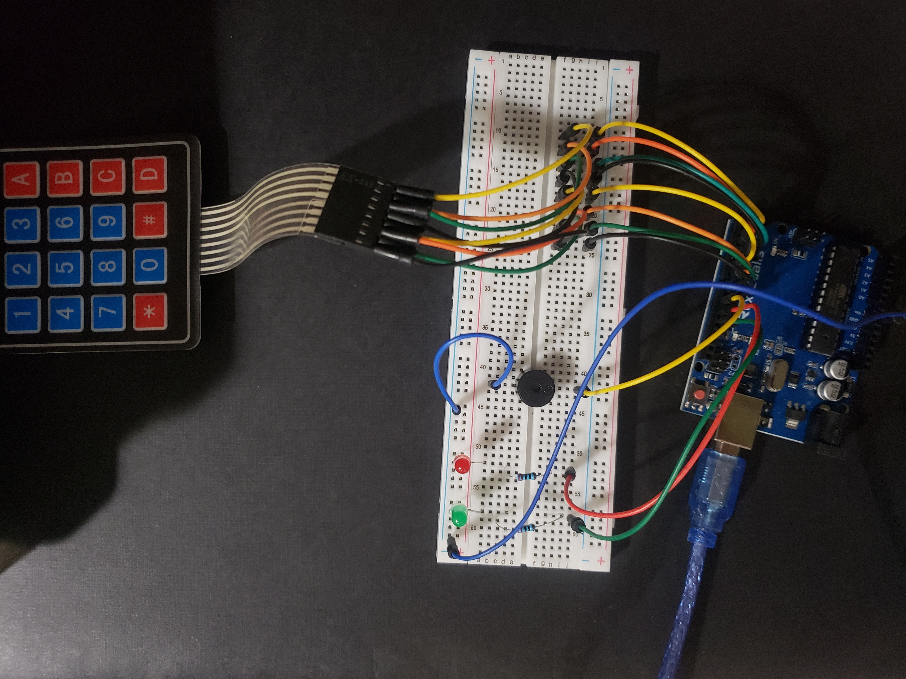

# Lesson 7: Arrays

## Coding Tools

## Arrays

An array is a variable that can hold multiple values instead of just one. An array can be any type of variable such as int, float, char, bool etc. Whatever type of values an array holds, that is the only type allowed. For example, an array cannot contain both int type and char type. Either, it would have to only contain int numbers or only char characters. Below, an array containing up to 10 integers is created.

```
int my_numbers[10];
```

Elements of the array could be assigned as shown below by specifying the index in the square brackets. Note that the index starts at 0 and goes up to 9 in this case (total of 10 numbers includes indexes 0, 1, 2, 3, 4, 5, 6, 7, 8, 9):

```
// initialize the array variable that is used to contain a phone number in this case
int phone_number[10];

// assign values to it
phone_number[0] = 3;
phone_number[1] = 0;
phone_number[2] = 9;
phone_number[3] = 8;
phone_number[4] = 6;
phone_number[5] = 7;
phone_number[6] = 5;
phone_number[7] = 3;
phone_number[8] = 0;
phone_number[9] = 9;
```

It is possible to create an array and assign values to it all in one line. The square brackets are left blank because the length is determined by the number of elements assigned to it.
```
char phone_number[] = { '3', '0', '9', '8', '6', '7', '5', '3', '0', '9' }; // length is 10 because there are 10 characters
```

Be carful to not try to use an index outside of the array bounds because the computer will crash while the program is running if this happens.

```
int phone_number[10];

phone_number[10] = 42; // program will crash here because 10 is outside of the array bounds (9 is the maximum index for an array containing 10 elements)
```

Elements of the array can be evaluated also by specifying the index in the square brackets.

```
int my_numbers[4];

my_numbers[0] = 10;
my_numbers[1] = 20;
my_numbers[2] = 30;
my_numbers[3] = 40;

if (my_numbers[0] == 10)
{
	my_numbers[0] = 42;
}

// my_numbers at index 0 will equal 42 once this code runs
```

It is also possible to have a multidimensional array. For example, a two dimensional array is shown below that has two rows and two columns:
```
int my_grid[2][2];

my_grid[0][0] = 0;
my_grid[0][1] = 1;
my_grid[1][0] = 2;
my_grid[1][1] = 3;
```

Values can be assigned to the two dimensional array when it is initialized:

```
int my_grid[2][2] = {
	{0, 1},
	{2, 3}
};
```

# Electrical Components

## Keypad

The keypad provided in the kit has eight wires coming from it. There is one wire for each row and one wire for each column. When a key is pressed, the wires from the row and column of that key are connected together. Buttons can be scanned for being pressed by setting the columns as INPUT_PULLUP and the rows as OUTPUT. Each row can be scanned by changing it to LOW while the other rows are HIGH. Then, check each column. If the column is also LOW, the button at that row and column is being pressed.



## Passive Buzzer

Passive buzzers create sound by sending PWM to it at 50% duty cycle (PWM was introduced in lesson 3). The frequency of the PWM is the frequency of the sound produced. When wiring, make sure that the side with the + sign is towards the output pin and the other side is towards ground.



# A Little Bit of History

## DTMF Dual-tone multi-frequency

Old phones used to make sounds when pressing buttons on the keypad. The sounds made for each button were determined according to DTMF. Two sounds would be created based on the row and column of the button being pressed. Look at the image below to see what two frequencies of sound would be produced for each button.



# Requirements

This lesson includes a keypad, passive buzzer, and two LEDs. When keys on the keypad are pressed, the passive buzzer should generate the two DTMF sounds by rapidly switching between the two frequencies. A password should be set in the code that is three characters long. If the user guesses the password on the keypad, the green LED should turn on for half a second. If the three key presses are wrong, then the red LED should turn on for half a second.

Since the keypad keys "jitter" when pressed, a timout of 300 milliseconds should be used after a key press is detected before checking again for key presses.

Below is the schematic and a picture of the wiring for this lesson.





Most of the code has been completed below. You need to look for all the comments in the code and add code that is suggested. The password is currently 123, but you can change it to any three valid characters. Take note of the arrays created at the top.

```
const char password[] = {'1', '2', '3'}; // you can change the password to contain any three keys
char input_password[] = {' ', ' ', ' '};
int input_password_position = 0;
const int password_length = 3;

const int total_key_pad_rows = 4;
const int total_key_pad_columns = 4;

const char key_pad_grid[4][4] = {
  {'1', '2', '3', 'A'},
  {'4', '5', '6', 'B'},
  {'7', '8', '9', 'C'},
  {'*', '0', '#', 'D'}
};

const int key_pad_row_pins[] = {9, 8, 7, 6};
// create constant int array called key_pad_column_pins containing the numbers 5, 4, 3, 2.
// 5 should be in index 0, 4 in index 1, 3 in index 2, and 2 in index 3.

void generate_phone_sound(int frequency_1, int frequency_2, unsigned long duration_milliseconds)
{
  unsigned long start_time = millis();

  int half_period_1 = 1000000 / (2 * frequency_1);
  int half_period_2 = 1000000 / (2 * frequency_2);

  while ((millis() - start_time) < duration_milliseconds)
  {
    digitalWrite(10, HIGH);
    delayMicroseconds(half_period_1);
    digitalWrite(10, LOW);
    delayMicroseconds(half_period_1);

    digitalWrite(10, HIGH);
    delayMicroseconds(half_period_2);
    digitalWrite(10, LOW);
    delayMicroseconds(half_period_2);
  }
}

char get_key_press()
{
  char key_pressed = ' ';
  for (int row = 0; row < total_key_pad_rows; row++)
  {
    digitalWrite(key_pad_row_pins[row], LOW);
    for (int column = 0; column < total_key_pad_columns; column++)
    {
      if (digitalRead(key_pad_column_pins[column]) == LOW)
      {
        key_pressed = // assign key_pressed value from key_pad_grid using row and column in for loops
      }
    }
    digitalWrite(key_pad_row_pins[row], HIGH);
  }

  return key_pressed;
}

void make_key_press_sound(char key_press)
{
  int row_tone_frequency = 0;
  int column_tone_frequency = 0;
  if (key_press == '0')
  {
    row_tone_frequency = // set dtmf row frequency for 0 key
    column_tone_frequency = // set dtmf column frequency for 0 key
  }
  else if (key_press == '1')
  {
    row_tone_frequency = // set dtmf row frequency for 1 key
    column_tone_frequency = // set dtmf column frequency for 1 key
  }
  else if (key_press == '2')
  {
    row_tone_frequency = // set dtmf row frequency for 2 key
    column_tone_frequency = // set dtmf column frequency for 2 key
  }
  else if (key_press == '3')
  {
    row_tone_frequency = // set dtmf row frequency for 3 key
    column_tone_frequency = // set dtmf column frequency for 3 key
  }
  else if (key_press == '4')
  {
    row_tone_frequency = // set dtmf row frequency for 4 key
    column_tone_frequency = // set dtmf column frequency for 4 key
  }
  else if (key_press == '5')
  {
    row_tone_frequency = // set dtmf row frequency for 5 key
    column_tone_frequency = // set dtmf column frequency for 5 key
  }
  else if (key_press == '6')
  {
    row_tone_frequency = // set dtmf row frequency for 6 key
    column_tone_frequency = // set dtmf column frequency for 6 key
  }
  else if (key_press == '7')
  {
    row_tone_frequency = // set dtmf row frequency for 7 key
    column_tone_frequency = // set dtmf column frequency for 7 key
  }
  else if (key_press == '8')
  {
    row_tone_frequency = // set dtmf row frequency for 8 key
    column_tone_frequency = // set dtmf column frequency for 8 key
  }
  else if (key_press == '9')
  {
    row_tone_frequency = // set dtmf row frequency for 9 key
    column_tone_frequency = // set dtmf column frequency for 9 key
  }
  else if (key_press == 'A')
  {
    row_tone_frequency = // set dtmf row frequency for A key
    column_tone_frequency = // set dtmf column frequency for A key
  }
  else if (key_press == 'B')
  {
    row_tone_frequency = // set dtmf row frequency for B key
    column_tone_frequency = // set dtmf column frequency for B key
  }
  else if (key_press == 'C')
  {
    row_tone_frequency = // set dtmf row frequency for C key
    column_tone_frequency = // set dtmf column frequency for C key
  }
  else if (key_press == 'D')
  {
    row_tone_frequency = // set dtmf row frequency for D key
    column_tone_frequency = // set dtmf column frequency for D key
  }
  else if (key_press == '#')
  {
    row_tone_frequency = // set dtmf row frequency for # key
    column_tone_frequency = // set dtmf column frequency for # key
  }
  else if (key_press == '*')
  {
    row_tone_frequency = // set dtmf row frequency for * key
    column_tone_frequency = // set dtmf column frequency for * key
  }

  if (row_tone_frequency > 0 && column_tone_frequency > 0)
  {
    generate_phone_sound(row_tone_frequency, column_tone_frequency, 100);
  }
}

void setup()
{
  pinMode(key_pad_column_pins[0], INPUT_PULLUP);
  pinMode(key_pad_column_pins[1], INPUT_PULLUP);
  pinMode(key_pad_column_pins[2], INPUT_PULLUP);
  pinMode(key_pad_column_pins[3], INPUT_PULLUP);
  pinMode(key_pad_row_pins[0], OUTPUT);
  pinMode(key_pad_row_pins[1], OUTPUT);
  pinMode(key_pad_row_pins[2], OUTPUT);
  pinMode(key_pad_row_pins[3], OUTPUT);
  pinMode(10, OUTPUT);
  pinMode(11, OUTPUT);
  pinMode(12, OUTPUT);

  digitalWrite(key_pad_row_pins[0], HIGH);
  digitalWrite(key_pad_row_pins[1], HIGH);
  digitalWrite(key_pad_row_pins[2], HIGH);
  digitalWrite(key_pad_row_pins[3], HIGH);
}

void loop()
{
  char key_press = get_key_press();
  make_key_press_sound(key_press);
  if (key_press != ' ')
  {
    input_password[input_password_position] = key_press;
    input_password_position++;
    if (input_password_position == password_length)
    {
      input_password_position = 0;
      bool password_correct = true;
      for (int i = 0; i < password_length; i++)
      {
        if (input_password[i] != password[i])
        {
          password_correct = false;
        }
      }

      if (password_correct)
      {
        // turn the green LED on for half a second
      }
      else
      {
        // turn the red LED on for half a second
      }
    }
    else
    {
      delay(300);
    }
  }
  else
  {
    delay(1);
  }
}

```