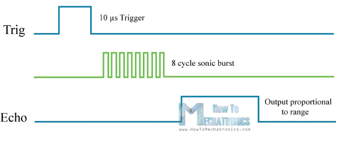
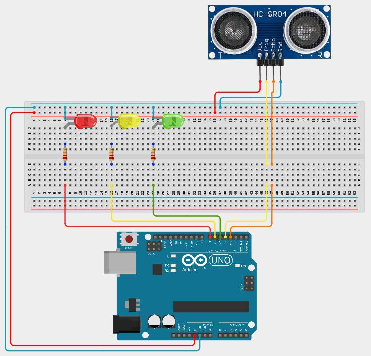
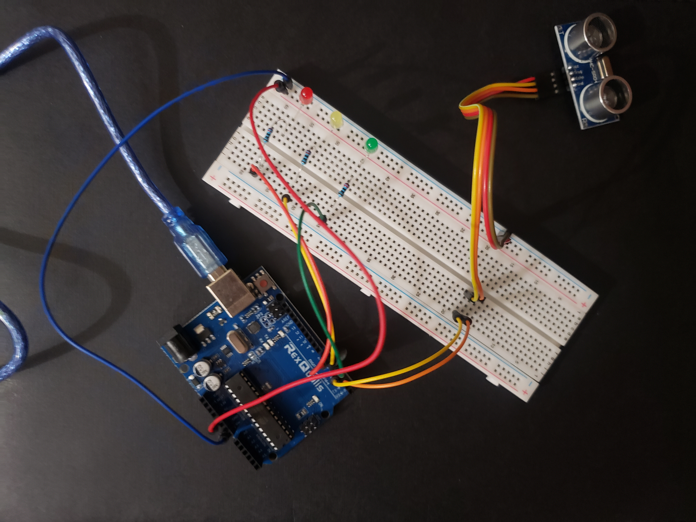

# Lesson 8: Interrupts

Interrupts are used in programming as an efficient way to interrupt the main flow of the program and briefly do something else. Once the interupt routine is done, it will return back to the main program. This is especially useful in embedded systems when it is necessary to measure some physical event that could happen at any time. You don't want to be constantly waiting for that event to happen while you could be doing other things. Instead, you can do other things and create an interrupt to occur when the physical event happens, inerrupting your main program only briefly. A common way to trigger an interrupt is when a pin changes states from low to high, or from high to low.

The Arduino IDE provides a function called attachInterrupt that allows you to create an interrupt triggered either on pin 2 or pin 3. The explanation for how attachInterrupt should be used is below.

## attachInterrupt

**attachInterrupt(interrupt_number, callback, pin_transition_to_trigger_interrupt);**

attachInterrupt is used to create an interrupt on pin 2 or 3. When the interrupt happens, it runs the callback function you provide. The interrupt is either triggered when the pin goes from low to high, high to low, or both based on pin_transition_to_trigger_interrupt

**parameters:**
1. **interrupt_number** - another function (digitalPinToInterrupt) is provided to convert pin to interrupt number (look at example below for more explanation)
2. **callback** - function you created and want to run when the interrupt is triggered
3. **pin_transition_to_trigger_interrupt** - RISING, FALLING, OR CHANGE (RISING to trigger when going from low to high, FALLING to trigger when going from high to low, or CHANGE when both)

**examples:**
```
volatile bool interrupt_triggered = false;

void my_callback()
{
	interrupt_triggered = true;
}

// create interrupt on pin 3 that triggers when the pin goes from low to high and when it goes from high to low.

attachInterrupt(digitalPinToInterrupt(3), my_callback, CHANGE);
```

Notice the volatile keyword used in the example above. That keyword must be used on any variables used inside the interrupt callback.

# Electrical Components

## Sonar Sensor

A sonar sensor detect distance by emitting a sound that then bounces off objects and travels back towards the sensor. The sonar sensor signals when the sound is emitted and when it returns. Based on the time it takes for the sound to return and the known speed of sound in air at room temperature, it is possible to calculate the distance to the object in front of the sensor.

The sonar sensor signals when the sound is sent and when it is recieved with its echo pin. When the echo pin goes high, that means the sound was just sent. When it returns to low, that means the sound was recieved after echoing off the object in front of the sonar sensor.

To start the measurement, the sonar sensor's trig pin should be set to high for approximately 10 microseconds.



The formula to calculate the distance based on the start and stop times of the measurement is:
```
distance = ((stop_time - start_time) * speed_of_sound) / 2
```

In our program, we will measure the time in microseconds. The speed of sound in air is 0.0343 centimeters per microsecond. Then, using the above formula with 0.0343 as speed_of_sound and start and stop time in microseconds will yield distance in centimeters.

# Requirements

This lesson includes a sonar sensor, and three LEDs that are the colors of a trafic light. One red, one yellow, and one green. When the sonar sensor is measuring a distance of 30 centimeters or greater, only the green LED should be on. If the distance is less than or equal to 30 centimeters and greater than 15 centimeters, only the yellow LED should be on. If the distance is less than or equal to 15 centimeters, only the red LED should be on.

Use an interrupt to record the start and stop time of the sonar sensor's measurement. Then, use the start and stop time to calculate the distance.

Below is the schematic and a picture of the wiring for this lesson.





A template is provided below. Most of it is complete. Go through and replace comments with the suggested code (except for the comment at the top that clarifies that speed_of_sound_in_air is centimeters per microsecond).

```
volatile int start_time = 0;
volatile int stop_time = 0;
volatile bool measurement_in_progress = false;
const float speed_of_sound_in_air = 0.0343; // centimeters per microsecond

float get_distance(int start_time_micros, int stop_time_micros)
{
  return ((stop_time_micros - start_time_micros) * speed_of_sound_in_air) * 0.5;
}

void set_traffic_light(char color)
{
  if (color == 'r')
  {
   // Only turn on the red LED
  }
  else if (color == 'g')
  {
    // Only turn on the green LED
  }
  else if (color == 'y')
  {
    // Only turn on the yellow LED
  }
}

void setup()
{
  pinMode(3, INPUT);
  pinMode(4, OUTPUT);
  pinMode(5, OUTPUT);
  pinMode(6, OUTPUT);
  pinMode(7, OUTPUT);
  // Use attachInterrupt to create an interrupt on pin 3 that is triggered both when the pin goes from low to high and when it goes from high to low.
  // The callback function should be measurement_received_handle
}

void loop()
{
  if (!measurement_in_progress)
  {
    float distance_in_centimeters = // uset start_time, stop_time, and the get_distance function
    if (distance_in_centimeters > 30)
    {
      // use set_traffic_light function to turn the green LED on
    }
    else if (distance_in_centimeters <= 30 && distance_in_centimeters > 15)
    {
      // use set_traffic_light function to turn the yellow LED on
    }
    else
    {
      // use set_traffic_light function to turn the red LED on
    }

    digitalWrite(4, HIGH);
    delayMicroseconds(10);
    digitalWrite(4, LOW);
    measurement_in_progress = true;
  }
  
  delay(100);
}

void measurement_received_handle()
{
  if (measurement_in_progress)
  {
    int echo_pin_state = digitalRead(3);
    if () // add condition of echo_pin_state when the measurement has just started
    {
      start_time = micros();
    }
    else
    {
      stop_time = micros();
      measurement_in_progress = false;
    }
  }
}

```
