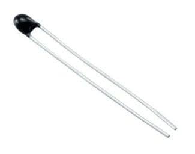
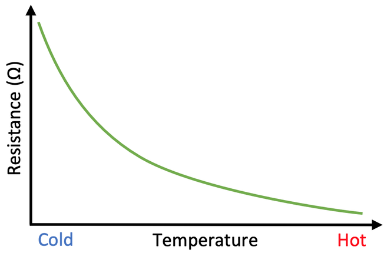
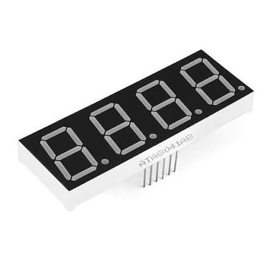
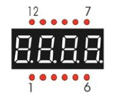
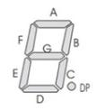
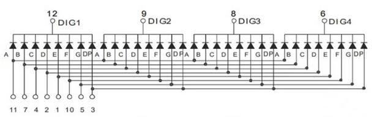
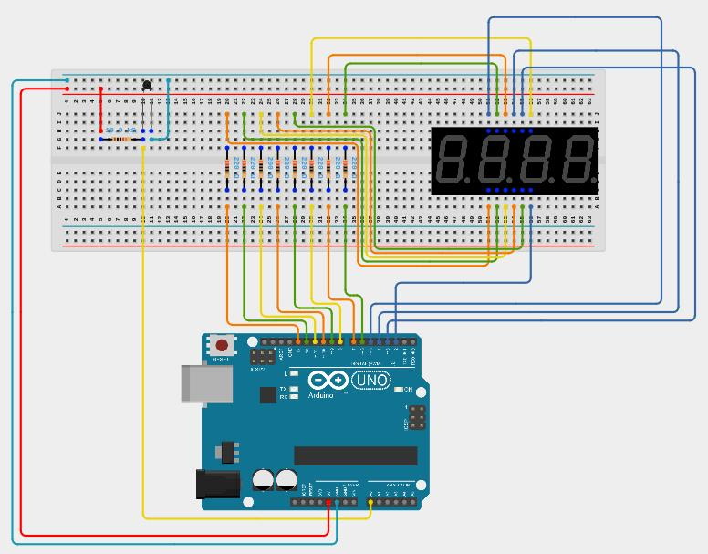
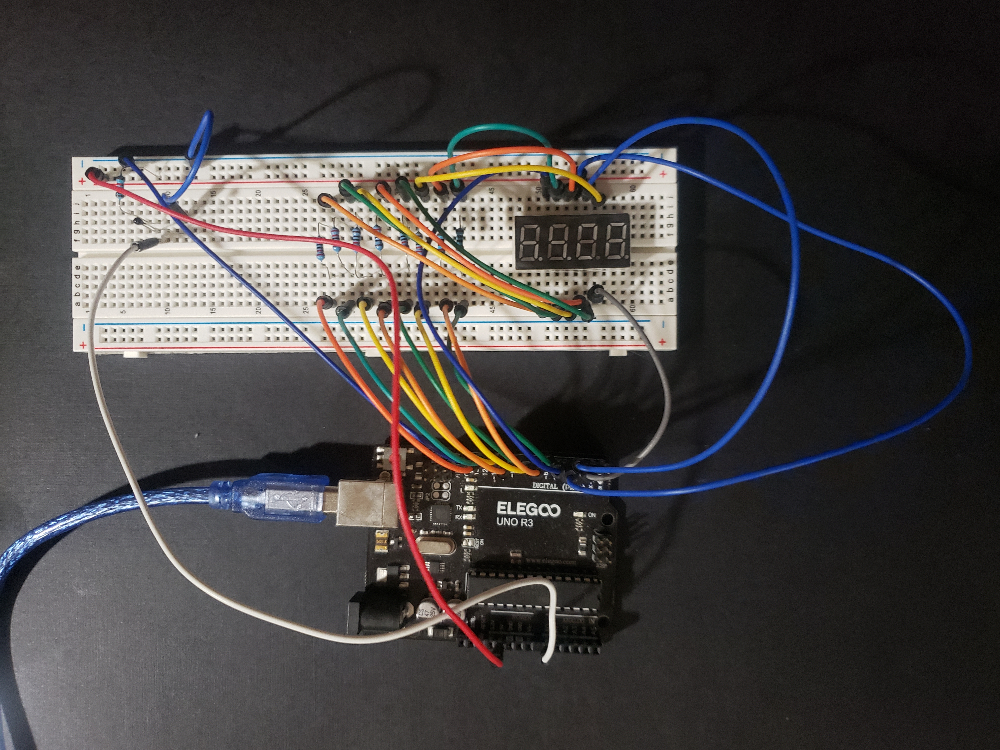

# Temperature Sensor

## Electrical Components

## Thermistor

Thermistors are like resistors except that their resistance changes in relation to temperature. This means that the voltage will also change and can be measured by the microcontroller to determine the temperature. A picture of a thermistor is shown below.



Thermistors' resistance decreases as temperature increases as shown in the figure below.



## 4 Digit 7 Segment Display

4 digit refers to being able to display 4 numbers. 7 segment refers to there being 7 independent lights used to display any number. Note that there is actually an eighth light as well for the decimal point. A picture of a 4 digit 7 segment display is shown below.



Here are pictures of how the 12 pins on the display are numbered and what LEDs they control.







Because there are 4 digits that all have 8 LEDs, there is a total of 32 LEDs. However, there are only 12 pins. So, how can all the LEDs be controlled? The answer is that only one digit can be displayed at a time. 8 of the 12 pins control which segments are on in a single digit while the remaining 4 pins control which digit is currently displayed. Having all four digits on at once is an illusion. Each digit is turned on for a very short period of time, say 1 millisecond. Then, the next digit is turned on. This keeps repeating over and over. Because the switch happens so fast, human eyes do not perceive that only one digit is on at a time. Instead, it looks like all four are on.

In summary:

Pins to control segments (pin goes high to turn LEd on):
| Pin on Display | Segment |
| :---           | :----:  |
| 1              | E       |
| 2              | D       |
| 3              | DP      |
| 4              | C       |
| 5              | G       |
| 7              | B       |
| 10             | F       |
| 11             | A       |

Pins to control which digit is on (digit goes low to turn on digit)

| Pin on Display | Digit  |
| :---           | :----: |
| 6              | 4      |
| 8              | 3      |
| 9              | 2      |
| 12             | 1      |

# Requirements

Use the thermistor to create a temperature sensor that displays the temperature in Fahrenheit on the 4 digit 7 segment display. The display only need display numbers from 00.00 to 99.99. The decimal place will be in the middle. The schematic (and a picture) for the project is shown below.





You can think of programming for this project in three steps.

1. Read analog signal from thermistor and convert it to temperature in Fahrenheit.
2. Extract each digit from temperature value in preparation to display (tens place, ones, place, tenths place, and hundredths place).
3. Display the four numbers on the 4 digit 7 segment display.

The first two steps have been taken care of for you with the below template. Your job is to finish filling out and use a function that can display a number on one of the four digits of the display. The function is called display_digit. Once it is filled out, use it in the loop block. Look for comments. You only need to make changes where comments are.

Tip: To check if you are getting an accurate temperature reading before you have the 4 digit 7 segment display setup, setup serial like you did in lesson 0 to print the temperature back to the serial monitor.

```
int loop_count = 0;
int tens = 0;
int ones = 0;
int tenths = 0;
int hundredths = 0;

const int a_pin = 6;
const int b_pin = 8;
const int c_pin = 10;
const int d_pin = 12;
const int e_pin = 13;
const int f_pin = 7;
const int g_pin = 9;
const int dp_pin = 11;

const int digit_1_pin = 5;
const int digit_2_pin = 4;
const int digit_3_pin = 3;
const int digit_4_pin = 2;

void display_digit(int number, int digit, bool decimal)
{
  int a = 0;
  int b = 0;
  int c = 0;
  int d = 0;
  int e = 0;
  int f = 0;
  int g = 0;
  int dp = 0;

  digitalWrite(a_pin, LOW);
  digitalWrite(b_pin, LOW);
  digitalWrite(c_pin, LOW);
  digitalWrite(d_pin, LOW);
  digitalWrite(e_pin, LOW);
  digitalWrite(f_pin, LOW);
  digitalWrite(g_pin, LOW);
  digitalWrite(dp_pin, LOW);

  digitalWrite(digit_1_pin, HIGH);
  digitalWrite(digit_2_pin, HIGH);
  digitalWrite(digit_3_pin, HIGH);
  digitalWrite(digit_4_pin, HIGH);

  if (number == 0)
  {
	// set segment variables for 0 to 1
  }
  else if (number == 1)
  {
	// set segment variables for 1 to 1
  }
  else if (number == 2)
  {
	// set segment variables for 2 to 1
  }
  else if (number == 3)
  {
	// set segment variables for 3 to 1
  }
  else if (number == 4)
  {
	// set segment variables for 4 to 1
  }
  else if (number == 5)
  {
	// set segment variables for 5 to 1
  }
  else if (number == 6)
  {
	// set segment variables for 6 to 1
  }
  else if (number == 7)
  {
	// set segment variables for 7 to 1
  }
  else if (number == 8)
  {
	// set segment variables for 8 to 1
  }
  else if (number == 9)
  {
	// set segment variables for 9 to 1
  }

  if (decimal)
  {
	// set segment variables for decimal point (dp) to 1
  }

  if (digit == 1)
  {
    digitalWrite(digit_1_pin, LOW);
  }
  else if (digit == 2)
  {
    digitalWrite(digit_2_pin, LOW);
  }
  else if (digit == 3)
  {
    digitalWrite(digit_3_pin, LOW);
  }
  else if (digit == 4)
  {
    digitalWrite(digit_4_pin, LOW);
  }

  digitalWrite(a_pin, a);
  digitalWrite(b_pin, b);
  digitalWrite(c_pin, c);
  digitalWrite(d_pin, d);
  digitalWrite(e_pin, e);
  digitalWrite(f_pin, f);
  digitalWrite(g_pin, g);
  digitalWrite(dp_pin, dp);
}

float get_temperature()
{
  int samples[5];
  float R0 = 10000.0;
  float R = 10000.0;
  float B = 3950.0;
  float T0 = 25.0;

  for (int i = 0; i< 5; i++)
  {
   samples[i] = analogRead(A0);
   delay(1);
  }
  
  float voltage_sum = 0.0;
  for (int i = 0; i < 5; i++)
  {
     voltage_sum += samples[i];
  }

  float average_voltage_reading = voltage_sum / 5;
  
  float average_R = R / (1023.0 / average_voltage_reading - 1.0);
  
  float temperature_celsius = (1.0 / ((1.0 / (T0 + 273.15)) + (1 / B) * log(average_R / R0))) - 273.15;
  float temperature_fahrenheit = (temperature_celsius * 1.8) + 32;
  return temperature_fahrenheit;
}

void setup()
{
  pinMode(digit_1_pin, OUTPUT);
  pinMode(digit_2_pin, OUTPUT);
  pinMode(digit_3_pin, OUTPUT);
  pinMode(digit_4_pin, OUTPUT);
  pinMode(a_pin, OUTPUT);
  pinMode(b_pin, OUTPUT);
  pinMode(c_pin, OUTPUT);
  pinMode(d_pin, OUTPUT);
  pinMode(e_pin, OUTPUT);
  pinMode(f_pin, OUTPUT);
  pinMode(g_pin, OUTPUT);
  pinMode(dp_pin, OUTPUT);

  digitalWrite(digit_1_pin, HIGH);
  digitalWrite(digit_2_pin, HIGH);
  digitalWrite(digit_3_pin, HIGH);
  digitalWrite(digit_4_pin, HIGH);

  digitalWrite(a_pin, LOW);
  digitalWrite(b_pin, LOW);
  digitalWrite(c_pin, LOW);
  digitalWrite(d_pin, LOW);
  digitalWrite(e_pin, LOW);
  digitalWrite(f_pin, LOW);
  digitalWrite(g_pin, LOW);
  digitalWrite(dp_pin, LOW);
}

void loop()
{
  if (loop_count == 0)
  {
    float temperature = get_temperature();

    tens = ((int)temperature / 10) % 10;
    ones = ((int)temperature) % 10;
    tenths = (int)(temperature * 10) % 10;
    hundredths = (int)(hundredths * 100) % 10;
  }

  // display all four digits with a decimal point in the middle
  // put a 1 millisecond delay between displaying each digit

  loop_count++;

  if (loop_count >= 1000)
  {
    loop_count = 0;
  }
}
```


